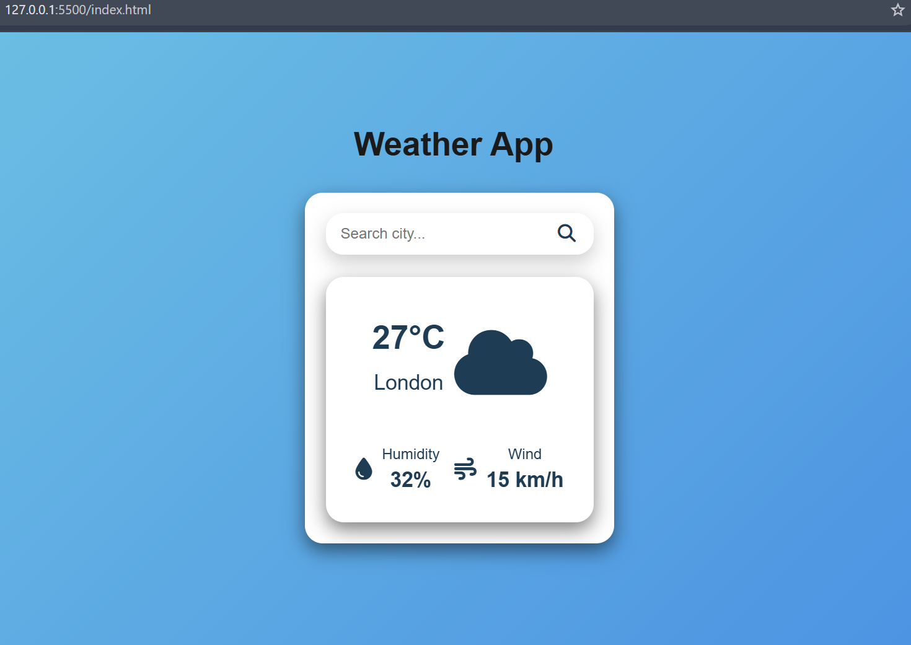
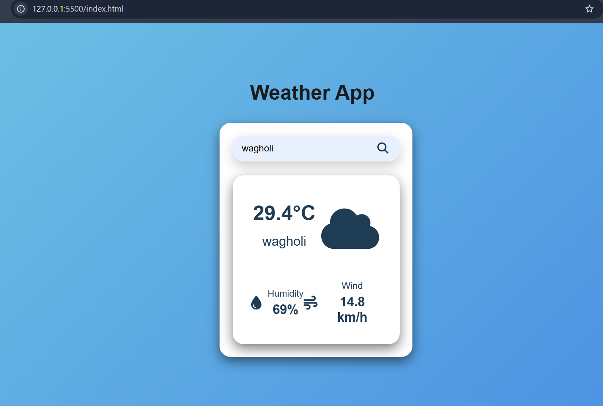

# Weather App
## Project Description

The Weather App is a simple and responsive frontend project built using HTML, CSS, and JavaScript.
It allows users to enter a city name and fetch real-time weather data from a public Weather API. The application displays important weather details such as temperature, humidity, wind speed, and overall weather conditions.

This project demonstrates API integration, DOM manipulation, and asynchronous JavaScript (fetch API).

# Features

- Search weather by city name
- Fetch real-time weather data using a public API
- Display:
  - Temperature
  - Humidity
  - Wind speed
  - Weather condition
- Error handling for invalid city names
- Simple and responsive user interface

# Technologies Used

HTML – Structure of the webpage

CSS – Styling and responsive design

JavaScript – Logic, API calls, and DOM manipulation

## How to Run the Project

1. Download or clone the repository.
2. Open the project folder.
3. Open index.html in your browser.

## Project Flow (How the App Works)

User enters city
      ↓
JavaScript Fetch API request
      ↓
Weather API server response (JSON)
      ↓
JavaScript parses data
      ↓
DOM updated dynamically

## Learning Outcomes

- Integrated a real-time REST API using JavaScript Fetch API.
- Practiced asynchronous programming with async/await and JSON data handling.
- Strengthened DOM manipulation by dynamically updating UI based on API responses.

## Folder Structure

weather-app-js/
│
├── index.html          
├── style.css           
├── script.js           
│
├── Screenshot/             
│     ├── weather-app-home.png
│     ├── weather-app-search.png
│     
└── README.md           

## Live Demo
https://shivani-gawade.github.io/weather-app-js/

## Screenshots

### Home

### Search Result

## Author

Shivani Gawade

